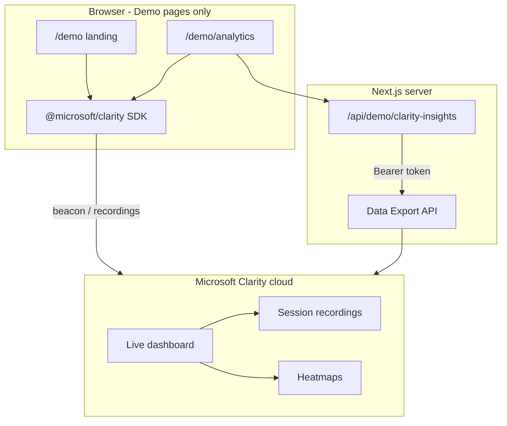

# Microsoft Clarity — Implementation & Learning Guide

This document explains **how Clarity is set up in the Propley project** (step by step) and serves as a **learning guide** for session recordings, heatmaps, and the Data Export API.

**Project ID (demo only):** `wsfm0rhyky`  
**Tracked routes only:** `/demo`, `/demo/analytics`  
**Main CRM portal:** Clarity is intentionally **disabled** (no site-wide script).

---

## Table of contents

1. [What is Microsoft Clarity?](#1-what-is-microsoft-clarity)
2. [Two ways we use Clarity](#2-two-ways-we-use-clarity)
3. [Architecture in this repo](#3-architecture-in-this-repo)
4. [Step-by-step implementation](#4-step-by-step-implementation)
5. [File reference](#5-file-reference)
6. [Environment variables](#6-environment-variables)
7. [How to test](#7-how-to-test)
8. [Session replay: why styles break (and our fix)](#8-session-replay-why-styles-break-and-our-fix)
9. [Data Export API](#9-data-export-api)
10. [Learning guide — concepts & APIs](#10-learning-guide--concepts--apis)
11. [Limits, security & operations](#11-limits-security--operations)
12. [Further reading](#12-further-reading)

---

## 1. What is Microsoft Clarity?

Microsoft Clarity is a **free** behavioral analytics tool for websites. It provides:

| Feature | What you get |
|--------|----------------|
| **Session recordings** | Video-like replay of user visits (clicks, scrolls, navigation) |
| **Heatmaps** | Aggregate click / scroll maps per page |
| **Insights** | Rage clicks, dead clicks, quick backs, excessive scroll, JS errors |
| **Data Export API** | Programmatic JSON export of dashboard metrics (last 1–3 days) |

Clarity is **not** a full product analytics stack (no funnels/attribution like GA4). It complements tools you already use by showing *how* people use the UI.

---

## 2. Two ways we use Clarity



| Layer | Technology | Purpose |
|-------|------------|---------|
| **Client SDK** | `npm install @microsoft/clarity` | Record sessions on demo pages only |
| **Static CSS** | `/public/demo/clarity-demo.css` | Replay renders with correct styles |
| **Server proxy** | `CLARITY_DATA_EXPORT_TOKEN` | Fetch metrics without exposing token to browser |
| **Dashboard** | clarity.microsoft.com | Watch replays & heatmaps (human UI) |

---

## 3. Architecture in this repo

### What we removed

- `src/components/MicrosoftClarity.tsx` — deleted  
- Root `src/app/layout.tsx` — **no** global Clarity script  
- Post-meeting analysis — no Clarity dashboard links (generic slide heatmaps only)

### What we added

- Demo route group under `src/app/demo/`  
- Clarity init only on demo surfaces  
- Optional Data Export API via `src/app/api/demo/clarity-insights/route.ts`  
- Voice agent orb / panel **skipped** on `/demo/*` so recordings stay clean

---

## 4. Step-by-step implementation

### Step 1 — Install the official npm package

```bash
npm install @microsoft/clarity
```

We use the package instead of pasting the script tag in HTML so init stays typed and colocated with React.

---

### Step 2 — Centralize config

**File:** `src/lib/clarity-config.ts`

- `CLARITY_PROJECT_ID` — your Clarity project id (`wsfm0rhyky`)
- `getDemoSiteOrigin()` — builds absolute site URL for CSS (replay fix)
- `getDemoStylesheetUrl()` — `https://yoursite.com/demo/clarity-demo.css`
- `getClarityProjectUrls()` — deep links to dashboard (recordings, heatmaps, etc.)
- `DEMO_TRACKED_PATHS` — documentation constant for `/demo` routes

---

### Step 3 — Client tracker component

**File:** `src/components/demo/ClarityTracker.tsx`

```tsx
'use client';
import Clarity from '@microsoft/clarity';

// On mount (demo pages only):
Clarity.init(CLARITY_PROJECT_ID);
Clarity.consent(true);
Clarity.setTag('surface', 'demo-landing' | 'demo-analytics');
Clarity.identify(...);
Clarity.event('view_demo_landing'); // on navigation between demo surfaces
```

**Rules:**

- Must run in a **client component** (`'use client'`) — Clarity needs `window`
- Init **once** per browser tab (module-level `initialized` flag)
- Mounted from:
  - `DemoLandingClient.tsx` → `page="demo-landing"`
  - `ClarityAnalyticsHub.tsx` → `page="demo-analytics"`

---

### Step 4 — Demo layout + replay-safe CSS

**Files:**

- `src/app/demo/layout.tsx` — loads stylesheet with **absolute URL** and `data-clarity-unmask="true"`
- `public/demo/clarity-demo.css` — all landing/analytics visual styles (no Tailwind-only dependency)

**Why not only Tailwind on the demo page?**  
Clarity replay often fails to load JS-injected or relative CSS. A **public static file** with an **absolute** `href` replays reliably.

```tsx
// demo/layout.tsx (simplified)
<link
  rel="stylesheet"
  href={getDemoStylesheetUrl()}  // e.g. http://localhost:3000/demo/clarity-demo.css
  data-clarity-unmask="true"
/>
<style data-clarity-unmask="true">{criticalCss}</style>
```

Set in `.env.local`:

```bash
NEXT_PUBLIC_SITE_URL=http://localhost:3000   # dev
# NEXT_PUBLIC_SITE_URL=https://your-production-domain.com  # prod
```

---

### Step 5 — Demo landing page (generate sessions)

**Files:**

- `src/app/demo/page.tsx` — server entry
- `src/components/demo/DemoLandingClient.tsx` — interactive UI + `Clarity.event()` on CTAs

User actions that create rich recordings:

- Scroll hero, gallery, developments  
- Nav clicks  
- Form submit → `Clarity.event('demo_inquiry_submit')` + `Clarity.identify(...)`

---

### Step 6 — Analytics hub page

**Files:**

- `src/app/demo/analytics/page.tsx`
- `src/components/demo/ClarityAnalyticsHub.tsx` — SDK status, links to Clarity dashboard, style troubleshooting
- `src/components/demo/ClarityLiveInsights.tsx` — tables from Data Export API

---

### Step 7 — Exclude Clarity from the main app shell

**Files modified:**

- `src/app/layout.tsx` — removed `<MicrosoftClarity />`
- `src/components/voice-agent/VoiceAgentLayoutWrapper.tsx` — if `pathname.startsWith('/demo')`, render children only (no voice sidebar)
- `src/components/voice-agent/OrbContainer.tsx` — return `null` on `/demo` routes

---

### Step 8 — Data Export API (server-only)

**Files:**

| File | Role |
|------|------|
| `src/types/clarity-export.ts` | Shared TypeScript types |
| `src/lib/clarity-export.server.ts` | `fetch()` to Clarity export endpoint |
| `src/app/api/demo/clarity-insights/route.ts` | Next.js GET proxy for the browser |
| `src/components/demo/ClarityLiveInsights.tsx` | UI tables + refresh |

**Flow:**

1. Browser calls `GET /api/demo/clarity-insights?numOfDays=3&dimension1=URL&demoOnly=true`
2. Server reads `process.env.CLARITY_DATA_EXPORT_TOKEN`
3. Server calls  
   `GET https://www.clarity.ms/export-data/api/v1/project-live-insights`  
   with header `Authorization: Bearer <token>`
4. Server optionally filters rows where `URL` contains `/demo`
5. JSON returned to the analytics page

**Token setup (you do this once):**

1. Clarity project → **Settings** → **Data Export** → **Generate new API token**
2. Add to `.env.local` (never commit):

   ```bash
   CLARITY_DATA_EXPORT_TOKEN=your_token_here
   ```

3. Restart `npm run dev`

---

### Step 9 — Manual script alternative (reference)

Clarity’s classic embed (we **do not** use this globally anymore; SDK is equivalent):

```html
<script type="text/javascript">
(function(c,l,a,r,i,t,y){
  c[a]=c[a]||function(){(c[a].q=c[a].q||[]).push(arguments)};
  t=l.createElement(r);t.async=1;t.src="https://www.clarity.ms/tag/"+i;
  y=l.getElementsByTagName(r)[0];y.parentNode.insertBefore(t,y);
})(window, document, "clarity", "script", "wsfm0rhyky");
</script>
```

Our `Clarity.init('wsfm0rhyky')` loads the same tag under the hood.

---

## 5. File reference

```
docs/MICROSOFT_CLARITY_GUIDE.md          ← this guide

src/lib/clarity-config.ts                ← project id, URLs, site origin
src/lib/clarity-export.server.ts         ← server fetch to export API
src/types/clarity-export.ts              ← response types

src/components/demo/
  ClarityTracker.tsx                     ← SDK init + tags/events
  DemoLandingClient.tsx                  ← demo landing UI
  ClarityAnalyticsHub.tsx                ← analytics hub shell
  ClarityLiveInsights.tsx                ← export API tables

src/app/demo/
  layout.tsx                             ← demo layout + CSS link
  page.tsx                               ← /demo
  analytics/page.tsx                     ← /demo/analytics

src/app/api/demo/clarity-insights/route.ts  ← API proxy

public/demo/clarity-demo.css             ← static styles for replay
```

---

## 6. Environment variables

| Variable | Required | Where | Purpose |
|----------|----------|-------|---------|
| `NEXT_PUBLIC_SITE_URL` | Recommended | Client + server | Absolute CSS URL for session replay |
| `CLARITY_DATA_EXPORT_TOKEN` | For API tables | **Server only** | Data Export API Bearer token |

See `.env.example` for templates.

---

## 7. How to test

### A. SDK (recordings & heatmaps)

1. `npm run dev`
2. Open http://localhost:3000/demo — click, scroll, submit form (30–60s)
3. Console: `typeof clarity` → `"function"`
4. Open http://localhost:3000/ — `typeof clarity` → `"undefined"` ✓
5. After 5–30 minutes: [Clarity recordings](https://clarity.microsoft.com/projects/view/wsfm0rhyky/recordings) — filter URL `/demo`
6. Open a replay — page should look **styled** (gold bar, hero, cards)

### B. Data Export API

```bash
curl "http://localhost:3000/api/demo/clarity-insights?numOfDays=3&dimension1=URL&demoOnly=true"
```

Or use **/demo/analytics** → **Live insights** section.

| Response | Meaning |
|----------|---------|
| `"configured": true` + `metrics` array | Working |
| HTTP 503 + not configured | Add `CLARITY_DATA_EXPORT_TOKEN` |
| HTTP 401 | Bad/expired token |
| HTTP 429 | 10 requests/day limit hit |

---

## 8. Session replay: why styles break (and our fix)

### Common causes

1. **Relative CSS URLs** — replay fetches wrong path → 404  
2. **Tailwind / CSS-in-JS only** — styles not in DOM at capture time  
3. **Strict masking** — Clarity strips `<link href="...">` as sensitive  
4. **localhost in production replay** — CSS URL points to dev machine

### Our fix checklist

- [x] Static file: `public/demo/clarity-demo.css`  
- [x] Absolute `href` via `NEXT_PUBLIC_SITE_URL`  
- [x] `data-clarity-unmask="true"` on `<link>` and critical `<style>`  
- [x] Class-based HTML on demo pages (not Tailwind-only for layout)  
- [ ] Production: set `NEXT_PUBLIC_SITE_URL` to live domain  
- [ ] Clarity → Settings → Masking → **Relaxed** if needed  
- [ ] Allow **Clarity-Bot** user-agent on CDN/WAF  

---

## 9. Data Export API

### Endpoint

```
GET https://www.clarity.ms/export-data/api/v1/project-live-insights
```

### Query parameters

| Param | Values | Description |
|-------|--------|-------------|
| `numOfDays` | `1`, `2`, `3` | Last 24h, 48h, or 72h (UTC) |
| `dimension1` | `URL`, `OS`, `Browser`, … | Breakdown dimension (up to 3) |
| `dimension2` | optional | Second breakdown |
| `dimension3` | optional | Third breakdown |

### Example response shape

```json
[
  {
    "metricName": "Traffic",
    "information": [
      {
        "totalSessionCount": "120",
        "URL": "https://yoursite.com/demo",
        "PagesPerSessionPercentage": 1.5
      }
    ]
  }
]
```

### Quotas (Microsoft limits)

- **10 requests per project per day**  
- Data only for the **last 1–3 days**  
- Max **1000 rows**, no pagination  

### What the API does *not* provide

- Session replay video files  
- Full heatmap image export via API  
- Real-time WebSocket stream  

Use the **Clarity dashboard** for recordings and heatmap UI.

---

## 10. Learning guide — concepts & APIs

### 10.1 Mental model

1. **Tag** runs in the browser → sends events to Clarity servers.  
2. **Dashboard** processes data → recordings, heatmaps, insights (delayed minutes to hours).  
3. **Export API** pulls aggregated metrics for integrations (your analytics page).

### 10.2 SDK methods we use (`@microsoft/clarity`)

| Method | When to use | Example in Propley |
|--------|-------------|-------------------|
| `Clarity.init(projectId)` | Once per app load | `ClarityTracker` |
| `Clarity.consent(true)` | GDPR/consent banner satisfied | Demo (implicit consent for internal demo) |
| `Clarity.setTag(key, value)` | Segment sessions | `surface: demo-landing` |
| `Clarity.identify(id, sessionId?, pageId?, name?)` | Tie session to user | After form submit |
| `Clarity.event(name)` | Custom funnels / actions | `demo_inquiry_submit`, `nav_gallery` |

### 10.3 Suggested learning path

| Week | Topic | Exercise |
|------|-------|----------|
| 1 | Install & verify SDK | Get `typeof clarity === "function"` on one page |
| 1 | Generate a session | Click 20+ elements, watch replay in dashboard |
| 2 | Heatmaps | Compare click map before/after UI change |
| 2 | Insights | Find rage clicks on `/demo` form |
| 3 | Custom events | Add `Clarity.event()` on each CTA |
| 3 | Tags | Filter dashboard by `surface` tag |
| 4 | Export API | Call proxy route; plot `Traffic` by `URL` |
| 4 | Replay CSS | Break styles on purpose, then apply static CSS fix |

### 10.4 Dashboard vs API — when to use which

| Need | Use |
|------|-----|
| Watch one user’s journey | Dashboard → Recordings |
| See where people click | Dashboard → Heatmaps |
| Build internal metrics widget | Data Export API |
| Alert on rage clicks | Export API + cron (respect 10/day limit) |
| A/B test analysis | Clarity filters + tags, or export + your BI tool |

### 10.5 Extending this implementation

**Add Clarity to another route (not recommended for main portal):**

1. Mount `<ClarityTracker page="..." />` on that route’s client component.  
2. Add static CSS + absolute URL if replay quality matters.  
3. Do **not** put the token in client code.

**Add a second dimension to export:**

```bash
curl "http://localhost:3000/api/demo/clarity-insights?numOfDays=2&dimension1=URL&dimension2=Device"
```

Extend `route.ts` to pass `dimension2` / `dimension3` from query string (already supported server-side).

**Production checklist:**

- [ ] `NEXT_PUBLIC_SITE_URL` = production URL  
- [ ] `CLARITY_DATA_EXPORT_TOKEN` in hosting env (Vercel/etc.), not in git  
- [ ] Rotate token if leaked  
- [ ] Cookie consent wired to `Clarity.consent()` if EU traffic  

---

## 11. Limits, security & operations

### Security

- **Never** commit `CLARITY_DATA_EXPORT_TOKEN` or paste tokens in chat/issues.  
- **Rotate** tokens if exposed; revoke old tokens in Clarity settings.  
- Export token is **server-only** — browser never sees it.  
- Project id (`wsfm0rhyky`) is public (same as script tag) — that is normal.

### Rate limits

| Limit | Value |
|-------|-------|
| Export API | 10 calls / project / day |
| Export data window | 1–3 days |
| Recording appearance delay | ~5–30 minutes typical |

### Operations

- Filter recordings: URL contains `/demo`  
- Filter heatmaps: same  
- If API returns empty: generate traffic on `/demo`, wait, disable “Only /demo URLs” filter  

---

## 12. Further reading

- [Clarity setup (Microsoft Learn)](https://learn.microsoft.com/en-us/clarity/setup-and-installation/clarity-setup)
- [Data Export API](https://learn.microsoft.com/en-us/clarity/setup-and-installation/clarity-data-export-api)
- [Troubleshooting recordings (CSS)](https://learn.microsoft.com/en-us/clarity/session-recordings/troubleshooting-recordings)
- [@microsoft/clarity on npm](https://www.npmjs.com/package/@microsoft/clarity)
- [Clarity blog — NPM integration](https://clarity.microsoft.com/blog/npm-integration/)

---

## Quick links (this project)

| Resource | URL |
|----------|-----|
| Demo landing | http://localhost:3000/demo |
| Analytics hub | http://localhost:3000/demo/analytics |
| Export API (local) | http://localhost:3000/api/demo/clarity-insights |
| Clarity dashboard | https://clarity.microsoft.com/projects/view/wsfm0rhyky |
| Recordings | https://clarity.microsoft.com/projects/view/wsfm0rhyky/recordings |
| Heatmaps | https://clarity.microsoft.com/projects/view/wsfm0rhyky/heatmaps |

---

*Last updated for the Propley `build-ai-voice-engine` worktree — demo-only Clarity integration.*
