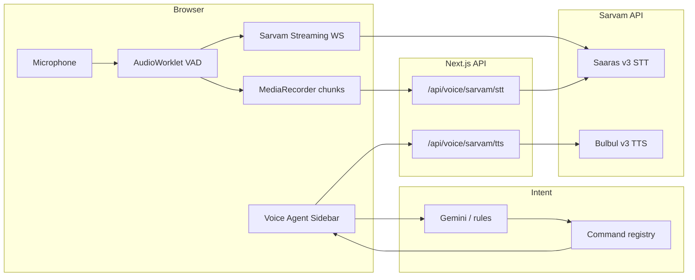

# Propley Voice Engine — Sarvam STT, TTS, and VAD

This guide explains how speech is captured, translated (Hindi → English), turned into CRM commands, and optionally spoken back using [Sarvam AI](https://docs.sarvam.ai/).

## Architecture overview



## Folder layout

| Path | Role |
| :--- | :--- |
| `src/services/sarvam/config.ts` | Models, URLs, defaults |
| `src/services/sarvam/sarvam-api.ts` | Client helpers → Next API routes |
| `src/services/sarvam/vad-controller.ts` | Local RMS VAD for REST chunks |
| `src/services/sarvam/propley-voice-stt.ts` | Main STT orchestrator (live vs native) |
| `src/services/sarvam/sarvam-streaming-stt.ts` | WebSocket STT + Sarvam VAD signals |
| `src/services/sarvam/sarvam-tts-player.ts` | Play Bulbul TTS in the browser |
| `src/services/sarvam/audio-utils.ts` | PCM → WAV for streaming |
| `src/app/api/voice/sarvam/stt/route.ts` | Server proxy STT (keeps key off client optional) |
| `src/app/api/voice/sarvam/tts/route.ts` | Server proxy TTS |
| `src/context/VoiceAgentProvider.tsx` | Mic lifecycle, transcript → Gemini, TTS on agent messages |
| `public/audio/propley-audio-processor.js` | AudioWorklet RMS + PCM frames |

## Speech-to-text (Saaras v3)

### REST (default — **REST + VAD** in settings)

1. `AudioWorklet` measures mic RMS → `VadController` detects end of utterance.
2. `MediaRecorder` stops; audio blob POSTed to `/api/voice/sarvam/stt`.
3. Route forwards multipart to `https://api.sarvam.ai/speech-to-text` with:
   - `model=saaras:v3`
   - `mode=translate` (default) — **Hindi and other Indic speech → English** for CRM intents
   - `language_code=unknown` — auto-detect

References:

- [Speech-to-Text REST API](https://docs.sarvam.ai/api-reference-docs/api-guides-tutorials/speech-to-text/rest-api)
- `mode=translate` table in [Streaming API](https://docs.sarvam.ai/api-reference-docs/api-guides-tutorials/speech-to-text/streaming-api)

### Streaming (optional)

1. Same mic + worklet; PCM batched to 16 kHz WAV chunks.
2. WebSocket `wss://api.sarvam.ai/speech-to-text/ws` with `high_vad_sensitivity=true` and `vad_signals=true`.
3. Server sends `START_SPEECH` / `END_SPEECH` and final `transcript`.

If the socket cannot authenticate from the browser, the app **falls back to REST**.

Reference: [Streaming Speech-to-Text API](https://docs.sarvam.ai/api-reference-docs/api-guides-tutorials/speech-to-text/streaming-api)

### Native mode (free)

`simulation` mode uses the browser **Web Speech API** (`en-IN`) — no Sarvam key.

## Text-to-speech (Bulbul v3)

When **Speak agent replies** is on in voice settings:

1. New `agent` chat messages trigger `speakWithSarvam()`.
2. POST `/api/voice/sarvam/tts` → `https://api.sarvam.ai/text-to-speech`.
3. Base64 WAV played via `HTMLAudioElement`.

Reference: [Text-to-Speech REST API](https://docs.sarvam.ai/api-reference-docs/api-guides-tutorials/text-to-speech/rest-api)

## Hindi → English flow

| User says (Hindi) | `sttMode` | STT output | Intent engine |
| :--- | :--- | :--- | :--- |
| मुझे राहुल के बारे में बताओ | `translate` | English command text | Gemini + rules → `client-info` |
| Same phrase | `transcribe` | Hindi script | May miss English-only rules |

**Recommendation:** keep **Translate to English** in voice settings (`sttMode: translate`).

## Environment variables

```env
# Preferred server-only key (used by /api/voice/sarvam/*)
SARVAM_API_KEY=

# Optional client fallback (also used if server key unset)
NEXT_PUBLIC_SARVAM_API_KEY=
```

## Voice settings (localStorage `propley_voice_agent_settings`)

| Field | Default | Meaning |
| :--- | :--- | :--- |
| `mode` | `live` if key present | `live` = Sarvam, `simulation` = Web Speech |
| `sttPipeline` | `rest` | `rest` or `streaming` |
| `sttMode` | `translate` | Saaras output mode |
| `highVadSensitivity` | `true` | Shorter silence before commit |
| `ttsEnabled` | `false` | Read agent replies aloud |
| `ttsSpeaker` | `shubh` | Bulbul voice id |

## SDK parity (Node / scripts)

The official SDK matches our REST payloads:

```javascript
import { SarvamAIClient } from "sarvamai";

const client = new SarvamAIClient({ apiSubscriptionKey: "YOUR_KEY" });

// STT — Hindi → English
const stt = await client.speechToText.transcribe({
  file: audioFile,
  model: "saaras:v3",
  mode: "translate",
});

// TTS
const tts = await client.textToSpeech.convert({
  text: "Opening Rahul Verma's profile.",
  model: "bulbul:v3",
  speaker: "shubh",
  target_language_code: "en-IN",
});
```

In the app we use **fetch + Next routes** instead of bundling the SDK in the browser.

## Testing checklist

1. Set `SARVAM_API_KEY` in `.env.local`, restart `npm run dev`.
2. Voice panel → **Sarvam AI** → **Translate to English**.
3. Say *"Tell me about Rahul"* in Hindi or English → disambiguation / brief.
4. Enable **Speak agent replies** → agent message should play as audio.
5. Try **REST + VAD** vs **Streaming** if your network allows WebSocket auth.

## Related docs

- Intent + CRM: `src/services/ai-engine/resolve-transcript.ts`, `command-registry.ts`
- Product copy: `src/lib/copy.ts` (`VOICE_ENGINE`)
